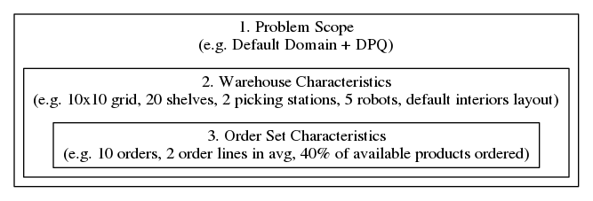

<h2>Table of Contents</h2>

<ul>
<li><a href="#org8664643">1. About</a></li>
<li><a href="#cid:b0f981f8-3202-42c0-a46e-aa6f1a52629b">2. Default Problem Domain</a>
<ul>
<li><a href="#cid:7e4e0e03-fa41-4809-8f83-b8e6a19986d7">2.1. Warehouse Floor Layout</a></li>
<li><a href="#orge8547dc">2.2. Products</a></li>
<li><a href="#orgb6d56f8">2.3. Shelves</a></li>
<li><a href="#org69f2daf">2.4. Robots</a></li>
<li><a href="#org41d34f7">2.5. Picking Stations</a></li>
<li><a href="#org0445896">2.6. Orders</a></li>
</ul>
</li>
<li><a href="#orgbc6f747">3. Key Characteristics of Instances (Default Problem Domain)</a>
<ul>
<li><a href="#org90756f8">3.1. Warehouse Characteristics</a>
<ul>
<li><a href="#cid:b3c44568-d34b-4c4d-bac0-a1483b4a99e8">3.1.1. Floor Topology Type</a></li>
<li><a href="#org425fceb">3.1.2. Floor Topology Layout</a></li>
<li><a href="#orgc912bc3">3.1.3. Interiors Layout: Placement of Highway Nodes, Shelves and Picking Stations</a></li>
<li><a href="#org022c9e3">3.1.4. Reachability of Shelves</a></li>
<li><a href="#orgc042fc8">3.1.5. Floor Size</a></li>
<li><a href="#org5f68dcf">3.1.6. Quantities of Interior Objects</a></li>
<li><a href="#orgf959c82">3.1.7. Dimensions of Shelf Clusters</a></li>
<li><a href="#org2118ffd">3.1.8. Ratio Between The Number of Shelves and Storage Nodes</a></li>
</ul>
</li>
<li><a href="#org91ef56f">3.2. Order Set Characteristics</a>
<ul>
<li><a href="#org7c2bedc">3.2.1. Number of Orders</a></li>
<li><a href="#orge79b27f">3.2.2. Minimum, Maximum and Average Number of Order Lines per Order</a></li>
<li><a href="#org431a482">3.2.3. Ratio Between the Number of Ordered and Overall Products</a></li>
</ul>
</li>
</ul>
</li>
<li><a href="#cid:bbacc203-29c4-489f-8661-95cf4b599fdd">4. Problem Domain Modifications</a>
<ul>
<li><a href="#cid:49448523-5e9b-4ed2-ac1a-6754d838b85c">4.1. Disregard of Product Quantities (DPQ)</a>
<ul>
<li><a href="#orgfe80509">4.1.1. Changed Order Characteristics</a></li>
</ul>
</li>
<li><a href="#cid:9828decd-6d59-4ccc-94c2-847b3a6b7a08">4.2. Product Capacity for Robots and Shelves Based on Quantity (CAQ)</a>
<ul>
<li><a href="#org247ebfe">4.2.1. Additional Warehouse Characteristics</a></li>
</ul>
</li>
<li><a href="#cid:87f0ecc2-45ff-4d7c-8583-8b5ed4c5fbbe">4.3. Product Capacity for Robots and Shelves Based on Weight (CAW)</a>
<ul>
<li><a href="#org3628f02">4.3.1. Additional Warehouse Characteristics</a></li>
</ul>
</li>
<li><a href="#cid:8c423d59-0c08-422f-b94d-720a0b6908e2">4.4. Product Capacity for Robots and Shelves Based on Volume (CAV)</a>
<ul>
<li><a href="#org763ae95">4.4.1. Additional Warehouse Characteristics</a></li>
</ul>
</li>
<li><a href="#cid:d8cd3118-7e68-4f20-8c1e-d868d32a96a3">4.5. Energy Management (EMA)</a>
<ul>
<li><a href="#orgbc7dfe1">4.5.1. Additional Warehouse Characteristics</a></li>
<li><a href="#org62863cb">4.5.2. Changed Warehouse Characteristics</a></li>
</ul>
</li>
<li><a href="#cid:d84e72a4-2202-4331-8636-b56dd264c641">4.6. Replenishment (REP)</a>
<ul>
<li><a href="#orgbb87cf2">4.6.1. Changed Warehouse Characteristics</a></li>
</ul>
</li>
<li><a href="#cid:88ef4c01-95a6-45f6-9d2c-b3b3c493964e">4.7. Orders Expire After Timeout (OEX)</a>
<ul>
<li><a href="#org4ae7362">4.7.1. Additional Order Set Characteristics</a></li>
</ul>
</li>
<li><a href="#cid:58b1d9d1-786b-4f92-b233-ddeb1e29dbb9">4.8. Orders Assigned To Picking Stations (OPS)</a></li>
<li><a href="#cid:1610eaee-45fb-476f-8184-403d386311b9">4.9. Online Processing of Orders, Orders Expire After Timeout (OOP)</a>
<ul>
<li><a href="#org62df9c9">4.9.1. Additional Order Set Characteristics</a></li>
<li><a href="#org88f8aaf">4.9.2. Change of Overall Problem Goal</a></li>
</ul>
</li>
</ul>
</li>
<li><a href="#orgdac5b7c">5. Supported Combinations of Modifications</a></li>
<li><a href="#org98e00b3">6. Classification of Instances</a></li>
<li><a href="#org38a4a8b">7. Input Format</a>
<ul>
<li><a href="#cid:f23fad45-7955-4f07-87ff-5370456e374b">7.1. General Concepts: Object-Types and Attributes</a>
<ul>
<li><a href="#cid:c06c73df-12c0-4fd6-977a-8f1ad64309be">7.1.1. Object-Types</a></li>
<li><a href="#cid:045df828-ed63-4a81-aa62-eba5c612e9f1">7.1.2. Object Definitions</a></li>
<li><a href="#cid:5c23775c-79b1-4b09-a7a8-fdd84a3afcb9">7.1.3. Object-Subtype Definitions</a></li>
</ul>
</li>
<li><a href="#cid:c279ce9c-c2ab-4e3f-9ec3-df2dd3a38188">7.2. Expected Object Types and Attributes</a>
<ul>
<li><a href="#orgf1a7776">7.2.1. Warehouse Floor (Grid Topology)</a></li>
<li><a href="#org605af56">7.2.2. Warehouse Floor (Grid Topology)</a></li>
<li><a href="#orgbabdf5e">7.2.3. Robots</a></li>
<li><a href="#org26f2900">7.2.4. Shelves</a></li>
<li><a href="#orgc9afefc">7.2.5. Products</a></li>
<li><a href="#org952e258">7.2.6. Orders</a></li>
<li><a href="#org3e90341">7.2.7. Picking Stations</a></li>
<li><a href="#org11e2db8">7.2.8. Charging Stations (Introduced by Energy Management)</a></li>
<li><a href="#org1bc6c71">7.2.9. Restocking Station (Introduced by Replenishment)</a></li>
</ul>
</li>
</ul>
</li>
<li><a href="#org696088f">8. Output Format</a></li>
<li><a href="#orgec192e1">9. Example Instance and Plan</a>
<ul>
<li><a href="#orgcc21009">9.1. Instance (<code>./examples/default/instance.asp</code>)</a></li>
<li><a href="#org6d9c7f5">9.2. Possible Plan (<code>./examples/default/outcome.txt</code>)</a></li>
</ul>
</li>
<li><a href="#orgcef5cb3">10. Alternative Problem Domain: GTAPF</a></li>
<li><a href="#orgfb1f783">11. References</a></li>
</ul>

# About

This is the problem specification of [ASPRILO](index.md). Subsequently, we

-   gradually specify the problem domain in different variations, beginning with the default scope
-   stipulate the technical instance and plan format
-   provide a example instance and plan

# Default Problem Domain

ASPRILO&rsquo;s benchmark scenario is inspired by intra-logistics and warehouse automation systems based
on multiple mobile robots and shelves. Its main goal is order fulfilment in a warehouse, i.e.,
order picking and sortation for a given set of product orders. Specifically, the warehouse floor
is laid out as a 2-dimensional grid. Products are stored in shelves, each located in a single grid
node. Mobile robots can move and navigate through the warehouse along the grid. Moreover, they can
carry and relocate shelves, as well as bring them to picking stations to deliver
products. Initially, all orders are known. An order is fulfilled if all its requested product
units are delivered to a picking station. The overall goal is hence to provide a plan in form of a
sequence of sets of robot actions such that all orders will be filled. In other words, the plan
should be based off a discrete time signal and each robot may perform a single action per time
point, i.e., robots may act concurrently. In the following, we provide a more detailed overview of
the *key components* of the problem.

## Warehouse Floor Layout

The warehouse floor is typically laid out as a *grid*, i.e.,

-   a 2-dimensional *grid graph*; or
-   a *partial* 2D grid graph (i.e., subgraph of a grid) to resemble more complex shapes:
    e.g. several rectangles connected by smaller passages, a cross-shaped grid, etc.

The grid may also contain special *highway nodes* that must never be occupied by a parked shelf.
Besides, we refer to grid nodes also as *storage nodes* if they are neither occupied by a
picking station nor are a highway node.

## Products

A *product* is a type of physical good that owns an unique identifier (e.g. part number,
universal product code). Products are typically handled in certain quantities, i.e., number of *units*,
e.g. 20 units of the product with unique identifier &rsquo;7324552&rsquo;.

## Shelves

*Shelves* store product units in limited quantities. Further, they occupy exactly one grid node
when parked.

## Robots

Mobile *robots* can freely move along the grid (even under shelves) as long as the grid node is
not already occupied by another robot.  Further, they can *pick up* a shelf when under it,
*carry* it while moving, and *put it down* eventually. While carrying a shelf, their movement is
restricted to fields clear of other shelves and robots. At a picking station, robots can *deliver*
product units from their shelf to the totes of the station. Moreover, robots occupy exactly one
grid node at each time point.

## Picking Stations

Picking stations store product units requested by orders for further processing. Further, picking stations consume one
grid node, and a robot can occupy the same node as picking station in order to deliver product
units to it.

## Orders

*Orders* are sets of *order lines*, i.e., a set of requests for products in certain quantities,
e.g. an order with 3 lines:

-   3 pens
-   2 notebooks
-   1 file folder

All orders are known initially (instead of arriving over time). Further, an order contains each
at most one order line per product. An order is *fulfilled* if all its requested product units
are delivered to a picking station.

# Key Characteristics of Instances (Default Problem Domain)

Here, we present the characteristics (without any claim of completeness) that we consider relevant
to distinguish problem instances. This is a preliminary step for our subsequent problem
classification which is, in turn, implemented by our [instance generator](manual.md). Instance characteristics
can be further divided up into aspects related to the instance&rsquo;s warehouse and set of orders,
respectively. Moreover, instance characteristics depend on the scope of the problem domain, and
the order set properties also depend on the warehouse characteristics.  In the following, we list
our instance characteristics for the default problem, and later expand on those in connection with
[problem domain modifications](#cid:bbacc203-29c4-489f-8661-95cf4b599fdd).

## Warehouse Characteristics

Besides the problem scope, the key aspects of the warehouse boil down to its floor plan
layout for which we can identify the following criteria.

### Floor Topology Type

For the floor topology, we distinguish between two basic graph types:

-   grid graph (default)
-   general two-dimensional graph<a id="fnr.1" class="footref" href="#fn.1">1</a>

### Floor Topology Layout

In case the [floor topology type](#cid:b3c44568-d34b-4c4d-bac0-a1483b4a99e8) is a grid, the topology layout is a rectangular grid graph by
default. Further, we can consider more complex grid shapes, e.g. several rectangles connected by
smaller corridors, a cross-shaped grid, a T-shaped grid, etc.

If the topology type is a general graph, we do not regard its layout at present.

### Interiors Layout: Placement of Highway Nodes, Shelves and Picking Stations

Here, we distinguish whether highway nodes, shelves and picking stations are placed randomly on
the grid or if a distinct pattern for the interiors layout is employed. For instance, a most
typical pattern (see Fig. [217](#orgc4e8333)) for rectangular warehouse grids is as follows:

-   shelves are placed in the center of the grid, divided up equally into rectangular clusters
-   picking stations evenly distributed around the edge of the grid;
-   one belt-way highway at the edge of the grid encompassing the shelves in the center;
-   many smaller lanes through the fields with shelves in the center of the grid.

In the following, we refer to this pattern as *default interiors layout*.

### Reachability of Shelves

A shelf is *reachable* if it can be carried to each picking station without moving other shelves
to clear path. A warehouse fulfills the *shelf-reachability* criterion if all shelves are
reachable.

### Floor Size

We consider the floor size in terms of number of grid nodes. Naturally, in the case that the
floor is a regular grid (instead of a partial one), it suffices to specify the x- and
y-dimensions of the grid to entail the number of grid nodes.

### Quantities of Interior Objects

We consider the quantities of interior objects, i.e., the number of

-   highway nodes
-   shelves
-   picking stations
-   robots

### Dimensions of Shelf Clusters

In conjunction with the [interiors layout](#orgc912bc3), we consider the dimension of rectangular shelf cluster
in x- and y-directions.

### Ratio Between The Number of Shelves and Storage Nodes<a id="fnr.1.100" class="footref" href="#fn.1">1</a>

We consider the floored ratio between the number of shelves an the storage nodes in the
warehouse.

## Order Set Characteristics

For order sets, we identified the following key aspects.

### Number of Orders

We consider the total of number of orders posed by the instance.

### Minimum, Maximum and Average Number of Order Lines per Order

We consider the minimum, maximum and floored average number of lines per order.

### Ratio Between the Number of Ordered and Overall Products<a id="fnr.1.100" class="footref" href="#fn.1">1</a>

We consider the floored ratio between the number of ordered and overall available products in
the warehouse. This is not be confused with the number of ordered and available product units.

# Problem Domain Modifications

Based on the [default problem domain](#cid:b0f981f8-3202-42c0-a46e-aa6f1a52629b), we can envision various additional modifications. For each
modification, we will subsequently describe it and enumerate the additional and changed instance
characteristics in comparison to the default problem. Besides, we will also point out if a
modification changes the overall goal of the problem.

## Disregard of Product Quantities (DPQ)

This is a simplification of the default domain in sense that we completely ignore product
quantities.  That is, we pretend that products on shelves are available in infinite quantities
and hence order lines only specify the product but not its quantity, since the latter is
consequently redundant. With that, a shelf at a picking station can fill an order if it holds the
required product.

### Changed Order Characteristics

1.  Ratio Between the Number of Ordered and Overall Products

    Not applicable here.

## Product Capacity for Robots and Shelves Based on Quantity (CAQ)

Robots and Shelves have a maximum quantity of products they can carry.

### Additional Warehouse Characteristics

1.  Mean Capacity of Shelves

    Mean (average, median, geometric, etc.) capacity of shelves.

2.  Mean Capacity of Robots

    Mean (average, median, geometric, etc.) capacity of robots.

## Product Capacity for Robots and Shelves Based on Weight (CAW)

Products have specifics weights, and robots and shelves have a maximum weight capacity they can carry.

### Additional Warehouse Characteristics

1.  Mean Capacity of Shelves

    Mean (average, median, geometric, etc.) capacity of shelves.

2.  Mean Capacity of Robots

    Mean (average, median, geometric, etc.) capacity of robots.

## Product Capacity for Robots and Shelves Based on Volume (CAV)

Products have specific volumes (i.e., the amount of enclosed space), and robots and shelves have a
maximum volume of products they can carry.

### Additional Warehouse Characteristics

1.  Mean Capacity of Shelves

    Mean (average, median, geometric, etc.) capacity of shelves.

2.  Mean Capacity of Robots

    Mean (average, median, geometric, etc.) capacity of robots.

## Energy Management (EMA)

Robots have electrical batteries and a consume energy for each action. Before a robot runs out of
energy, it has to move to a *charging stations* to recharge its battery. Those stations occupy a
floor node and a single robot can enter them at a time. Further, each charging station has a
distinct charge rate.

### Additional Warehouse Characteristics

1.  Placement/Number/Ratio of Charging Stations

    We consider
    
    -   placement layout of charging stations (e.g. all stations evenly distributed across the floor
        vs. all located within a small area of the floor)
    -   number of charging stations
    -   ratio of charging stations w.r.t robots and floor size.

2.  Mean Robots&rsquo; Battery Capacity

    Mean (average, median, geometric, etc.) robots&rsquo; battery capacity.

3.  Mean Robots&rsquo; Recharge Speed

    Mean (average, median, geometric, etc.) amount of energy a robot can recharge at a charging station at each time step.

4.  Mean Battery Capacity

    Mean (average, median, geometric, etc.) battery capacity of a robot.

5.  Mean Robots&rsquo; Energy Consumption

    Mean (average, median, geometric, etc.) amount of energy consumed by robot actions independent
    of the type of action.

### Changed Warehouse Characteristics

1.  Interiors Layout: Placement of Charging Stations

    In addition to the default problem&rsquo;s interiors layout, the placement of the charging stations
    stations have to be considered too.
    
    TODO: default pattern

## Replenishment (REP)

The warehouse, i.e., its shelf are periodically replenished by suppliers. To that end the
warehouse needs to order products from suppliers who deliver those with a certain delay to the
replenishment stations in the warehouse. To retrieve product units from a replenishment station,
a robot can bring a shelf to it for restocking. Further, each shelf has only a limited capacity
to store products.

### Changed Warehouse Characteristics

1.  Interiors Layout: Placement of Replenishment Stations

    In addition to the default problem&rsquo;s interiors layout, the placement of the replenishment
    stations have to be considered too.
    
    TODO: default pattern

## Orders Expire After Timeout (OEX)

Each order expires after a specific timeout, i.e., number of time steps. The countdown starts
upon the arrival of the order. An order cannot be fulfilled after it has expired.

### Additional Order Set Characteristics

1.  Mean Expiration Timeout for Orders

    Mean (average, median, geometric, etc.) expiration timeout for orders.

## Orders Assigned To Picking Stations (OPS)

Each order is assigned to a specific picking stations to which its order lines have to be
delivered.

## Online Processing of Orders, Orders Expire After Timeout (OOP)

The set of orders is streamed in over time where each time step corresponds to an amount of
seconds. Further, we assume that [orders expire as described before](#cid:88ef4c01-95a6-45f6-9d2c-b3b3c493964e) and hence the planning system
has to process them online.

### Additional Order Set Characteristics

1.  Mean Number of Expiring Order Lines per Second

    Mean (average, median, geometric, etc.) number of expiring order lines per second.

### Change of Overall Problem Goal

At each time point, all unfulfilled orders must not expire.

# Supported Combinations of Modifications

In table below, we illustrate combinations of two problem modifications that we (plan to)
support by our tools.

<table border="2" cellspacing="0" cellpadding="6" rules="groups" frame="hsides">
<caption class="t-above">Table 1: Supported pairwise combinations of problem modifications.</caption>

<colgroup>
<col  class="org-left" />
</colgroup>

<colgroup>
<col  class="org-left" />

<col  class="org-left" />

<col  class="org-left" />

<col  class="org-left" />

<col  class="org-left" />

<col  class="org-left" />

<col  class="org-left" />

<col  class="org-left" />

<col  class="org-left" />
</colgroup>
<thead>
<tr>
<th scope="col" class="org-left">&#xa0;</th>
<th scope="col" class="org-left">DPQ</th>
<th scope="col" class="org-left">CAQ</th>
<th scope="col" class="org-left">CAW</th>
<th scope="col" class="org-left">CAV</th>
<th scope="col" class="org-left">EMA</th>
<th scope="col" class="org-left">REP</th>
<th scope="col" class="org-left">OEX</th>
<th scope="col" class="org-left">OPS</th>
<th scope="col" class="org-left">OOP</th>
</tr>
</thead>

<tbody>
<tr>
<td class="org-left">DPQ</td>
<td class="org-left">&#xa0;</td>
<td class="org-left">&#xa0;</td>
<td class="org-left">&#xa0;</td>
<td class="org-left">&#xa0;</td>
<td class="org-left">&check;</td>
<td class="org-left">&#xa0;</td>
<td class="org-left">&check;</td>
<td class="org-left">&check;</td>
<td class="org-left">&check;</td>
</tr>

<tr>
<td class="org-left">CAQ</td>
<td class="org-left">&#xa0;</td>
<td class="org-left">&#xa0;</td>
<td class="org-left">&#xa0;</td>
<td class="org-left">&#xa0;</td>
<td class="org-left">&check;</td>
<td class="org-left">&check;</td>
<td class="org-left">&check;</td>
<td class="org-left">&check;</td>
<td class="org-left">&check;</td>
</tr>

<tr>
<td class="org-left">CAW</td>
<td class="org-left">&#xa0;</td>
<td class="org-left">&#xa0;</td>
<td class="org-left">&#xa0;</td>
<td class="org-left">&check;</td>
<td class="org-left">&check;</td>
<td class="org-left">&check;</td>
<td class="org-left">&check;</td>
<td class="org-left">&check;</td>
<td class="org-left">&check;</td>
</tr>

<tr>
<td class="org-left">CAV</td>
<td class="org-left">&#xa0;</td>
<td class="org-left">&#xa0;</td>
<td class="org-left">&check;</td>
<td class="org-left">&#xa0;</td>
<td class="org-left">&check;</td>
<td class="org-left">&check;</td>
<td class="org-left">&check;</td>
<td class="org-left">&check;</td>
<td class="org-left">&check;</td>
</tr>

<tr>
<td class="org-left">EMA</td>
<td class="org-left">&check;</td>
<td class="org-left">&check;</td>
<td class="org-left">&check;</td>
<td class="org-left">&check;</td>
<td class="org-left">&#xa0;</td>
<td class="org-left">&check;</td>
<td class="org-left">&check;</td>
<td class="org-left">&check;</td>
<td class="org-left">&check;</td>
</tr>

<tr>
<td class="org-left">REP</td>
<td class="org-left">&#xa0;</td>
<td class="org-left">&check;</td>
<td class="org-left">&check;</td>
<td class="org-left">&check;</td>
<td class="org-left">&check;</td>
<td class="org-left">&#xa0;</td>
<td class="org-left">&check;</td>
<td class="org-left">&check;</td>
<td class="org-left">&check;</td>
</tr>

<tr>
<td class="org-left">OEX</td>
<td class="org-left">&check;</td>
<td class="org-left">&check;</td>
<td class="org-left">&check;</td>
<td class="org-left">&check;</td>
<td class="org-left">&check;</td>
<td class="org-left">&check;</td>
<td class="org-left">&#xa0;</td>
<td class="org-left">&check;</td>
<td class="org-left">&check;</td>
</tr>

<tr>
<td class="org-left">OPS</td>
<td class="org-left">&check;</td>
<td class="org-left">&check;</td>
<td class="org-left">&check;</td>
<td class="org-left">&check;</td>
<td class="org-left">&check;</td>
<td class="org-left">&check;</td>
<td class="org-left">&check;</td>
<td class="org-left">&#xa0;</td>
<td class="org-left">&check;</td>
</tr>

<tr>
<td class="org-left">OOP</td>
<td class="org-left">&check;</td>
<td class="org-left">&check;</td>
<td class="org-left">&check;</td>
<td class="org-left">&check;</td>
<td class="org-left">&check;</td>
<td class="org-left">&check;</td>
<td class="org-left">&check;</td>
<td class="org-left">&check;</td>
<td class="org-left">&#xa0;</td>
</tr>
</tbody>
</table>

A combination of more than two modifications is supported if there is a supported pairwise
combination for all modifications in question.

# Classification of Instances

Having a clear notion of the problem&rsquo;s domain and key characteristics, we are now ready to
systematically categorize its instances. In particular, we hierarchically classify sub-problems
and their instances based on their

1.  problem scope ([default domain](#cid:b0f981f8-3202-42c0-a46e-aa6f1a52629b) and [potential modifications](#cid:bbacc203-29c4-489f-8661-95cf4b599fdd))
2.  [warehouse characteristics](#org90756f8) (in context of the problem scope)
3.  [order set characteristics](#org91ef56f) (in context of the problem scope and warehouse characteristics)

in descending order, also illustrated in Fig. [84](#org4130aab).

# Input Format

## General Concepts: Object-Types and Attributes

At first, we need to agree on a general encoding schema for instances. In particular, we
introduce

-   [object types](#cid:c06c73df-12c0-4fd6-977a-8f1ad64309be) which are all predetermined by the domain; as well as
-   concrete [object](#cid:045df828-ed63-4a81-aa62-eba5c612e9f1) and [object-subtype](#cid:5c23775c-79b1-4b09-a7a8-fdd84a3afcb9) definitions which are both specified by instances.

### Object-Types

For the technical specification of problem instances, we first need to identify the
*objects-types* relevant to the problem. Specifically, an object-type represents a subset of the
objects in the problem domain. Additionally, it defines a set of *attributes* common to its
objects. Further, applicable object-types and attributes may vary depending on the problem
scope. For example, we determine the following object-types for the default problem:

-   `grid-node` with attribute `at`
-   `robot` with attribute `at`
-   `shelf` with attribute `at`
-   `product` with attribute `on`
-   `order` with attributes `line` and `pickingStation`
-   `pickingStation` with attribute `at`

The complete list of [expected object types and their attributes](#cid:c279ce9c-c2ab-4e3f-9ec3-df2dd3a38188) is given below.

### Object Definitions

All instance data (except object-subtypes) is represented as `init/2` facts of the format

    init(object(<object-type>, <object-id>), value(<attribute>, <value>)).

where

-   function `object` refers to an object by its type `<object-type>` and relative identifier
    `<object-id>`, e.g. `object(robot, 34)` for a robot with ID 34
-   function `value` specifies that the object&rsquo;s attribute `<attribute>` has value `<value>` e.g.
    
        init(object(robot, 34), value(at, (2,3))).
    
    states that the robot 34 is at x/y-location (2,3).

### Object-Subtype Definitions

    init(subtype(<object-type>, <subtype-id>), value(<attribute>, <value>))

Object-Subtypes refine object-types in terms of a common characteristics, e.g. shelves with same
capacity, robots with same maximum payload weight, products of the category &rsquo;food&rsquo;, etc. To
define an object-subtype of a given object-type, one uses facts of the form

    init(subtype(<object-type>, <subtype-id>), value(<attribute>, <value>)).

where

-   function `subtype` refers to a subtype by its parent object-type <object-type> and its
    relative identifier <subtype-id>, e.g. `subtype(robot, 3)` for a subtype of `robot` with RID 3
-   function `value` specifies that the subtype&rsquo;s attribute `<attribute>` has value `<value>`,
    e.g.for a given object-type `robot`
    
        init(subtype(robot, 3), value(maxEnergy, 250)).
    
    states that robots of object-subtype 3 have a battery with maximum energy capacity of 250.

To declare that an object-type belongs to a object-subtype the attribute `subtype` is
used, e.g.

    init(object(robot, 34), value(subtype, 3)).

states that robot 34 is of object-subtype 3 and hence &ldquo;inherits&rdquo; the maximum energy capacity of

1.  

In general, any `value` to `attribute` assignment of an object may be determined by an
associated object-subtype, except for `subtype` itself. However, for each object and `attribute`,
there may only exists at most one `value` assignment, including the assignments inherited from
the object&rsquo;s subtypes.

## Expected Object Types and Attributes

### Warehouse Floor (Grid Topology)

In case the [floor topology type](#cid:b3c44568-d34b-4c4d-bac0-a1483b4a99e8) is a grid, the [warehouse floor](specification.md) uses exclusively **either**
object-type `grid` or objec-type `node` for its specification.

1.  Specified by Dimensions (`grid`)

    -   For the simple case that the warehouse is a (regular) grid, i.e., all nodes of the grid can be
        occupied by robots and shelves, it suffices to state the grid&rsquo;s x,y-dimension via attribute
        `xsize` and `ysize`, e.g.
        
            init(object(grid,1), value(xsize, 45)).
            init(object(grid,1), value(ysize, 35)).
        
        states that the x,y-dimensions are 45 and 35.

2.  Specified by Nodes (`node`)

    -   For the more general case that warehouse is a partial grid, i.e., only specific nodes
        of a warehouse grid can be occupied by robots and shelves, each of those nodes has to be
        explicitly stated via attribute `at`, e.g.
        
            init(object(node, 1), value(at, (1,5))).
            init(object(node, 2), value(at, (2,5))).
        
        states that there exist grid nodes 1 and 2 at coordinates (1,5) and (2,5), resp.
    -   Remark: in the problem encoding, `node` facts can be seen as generalization of `grid` in the
        sense that `grid` facts can always be translated to corresponding `node` facts.

### Warehouse Floor (Grid Topology)

TODO: floor encoding for general topology graphs

### Robots

[Robots](#org69f2daf) use object-type `robot` for their specification. Their attributes are defined depending
on the problem domain scope as follows:

1.  Attributes Related to [Default Domain](#cid:b0f981f8-3202-42c0-a46e-aa6f1a52629b)

    -   The grid position of a robot is indicated by attribute `at`, e.g.
        
            init(object(robot, 1), value(at, (2,3))).
        
        states that robot 1 is at location (2,3).
    -   A situation where a robot initially carries a shelf is indicated by attribute ~carries, e.g.
        
            init(object(robot, 2), value(carries, 5)).
        
        states that robot 2 is carrying shelf 5.

2.  Attributes Related to [Energy-Management](#cid:d8cd3118-7e68-4f20-8c1e-d868d32a96a3)

    -   The battery level of a robot is indicated by attribute `energy`, e.g.
        
            init(object(robot, 1), value(energy, 23)).
        
        states that robot 1 has battery level 23.
    -   The maximum energy capacity of robot&rsquo;s battery is indicated by attribute `maxEnergy`, e.g.
        
            init(object(robot, 1), value(maxEnergy, 250)).
        
        states that robots 1 has a battery with maximum energy capacity of 250.

3.  Attributes Related to [Quantity-Based Product Capacities](#cid:9828decd-6d59-4ccc-94c2-847b3a6b7a08)

    -   The maximum number of product units a robot can carry is indicated by attribute `maxQuantity`,
        e.g.
        
            init(object(robot, 1), value(maxQuantity, 20)).
        
        states that robots 1 can carry up to 20 product units.

4.  Attributes Related to [Weight-Based Product Capacities](#cid:87f0ecc2-45ff-4d7c-8583-8b5ed4c5fbbe)

    -   The maximum weight a robot can carry is indicated by attribute `maxWeight`, e.g.
        
            init(object(robot, 1), value(maxWeight, 500)).
        
        states that robots 1 can carry a payload weight of up to 500.

5.  Attributes Related to [Volume-Based Product Capacities](#cid:8c423d59-0c08-422f-b94d-720a0b6908e2)

    -   The maximum volume a robot can carry is indicated by attribute `maxVolume`, e.g.
        
            init(object(robot, 1), value(maxVolume, 267)).
        
        states that robots 1 can carry a payload volume of up to 267.

6.  Example

        init(object(robot, 1), value(maxEnergy, 250)).
        init(object(robot, 1), value(subtype, 3)).
        init(object(subtype(robot), 3), value(maxWeight, 500)).
    
    states that
    
    1.  robots 1 has a battery with maximum energy capacity of 250
    2.  robot 1 is of object-subtype 3 (as explained in [Object-Subtypes](#cid:5c23775c-79b1-4b09-a7a8-fdd84a3afcb9))
    3.  robots of object-subtype 3 can carry a payload of up to 500 weight

### Shelves

[Shelves](#orgb6d56f8) use object-type `shelf` for their specification.

1.  Attributes Related to [Default Domain](#cid:b0f981f8-3202-42c0-a46e-aa6f1a52629b)

    -   The grid position of a shelf is indicated by attribute `at`, e.g.
        
            init(object(shelf, 1), value(at, (2,3))).
        
        states that shelf 1 is at location (2,3).

2.  Attributes Related to [Quantity-Based Product Capacities](#cid:9828decd-6d59-4ccc-94c2-847b3a6b7a08)

    -   The quantitative capacity of a shelf is indicated by attribute
        `maxQuantity`, e.g.
        
            init(object(shelf, 1), value(maxQuantity, 20)).
        
        states that shelf 1 has a maximum quantitative capacity of 20.

3.  Attributes Related to [Weight-Based Product Capacities](#cid:87f0ecc2-45ff-4d7c-8583-8b5ed4c5fbbe)

    -   The weight-based capacity of a shelf is indicated by attribute
        `maxWeight`, e.g.
        
            init(object(shelf, 1), value(maxWeight, 23)).
        
        states that shelf 1 has a maximum weight capacity of 23.

4.  Attributes Related to [Volume-Based Product Capacities](#cid:8c423d59-0c08-422f-b94d-720a0b6908e2)

    -   The volume-based capacity of a shelf is indicated by attribute
        `maxVolume`, e.g.
        
            init(object(shelf, 1), value(maxVolume, 267)).
        
        states that shelf 1 has a maximum volume capacity of 267.

5.  Example

        init(object(shelf, 3), value(maxVolume, 200)).
        init(object(shelf, 3), value(subtype, 1)).
        init(object(subtype(shelf), 1), value(maxWeight, 23)).
    
    states that
    
    1.  shelf 3 has a maximum volume capacity of 200.
    2.  shelf 3 is of object-subtype 1 (as explained in Sec. [Object-Subtypes](#cid:5c23775c-79b1-4b09-a7a8-fdd84a3afcb9))
    3.  shelves of object-subtype 1 have a maximum weight capacity of 23.

### Products

[Products](#orge8547dc) use object-type `product` for their specification.

1.  Attributes Related to [Default Domain](#cid:b0f981f8-3202-42c0-a46e-aa6f1a52629b)

    -   A shelf on which a product is stored on is indicated by attribute `on`, e.g.,
        
            init(object(product, 45), value(on, (5, 280)).
        
        states that 280 units of product 45 are on shelf 5.

2.  Attributes Related to [Disregard of Product Quantities](#cid:49448523-5e9b-4ed2-ac1a-6754d838b85c)

    -   In case product quantities are ignored, the value of `on` is a single integer indicating the
        shelf, e.g.
        
            init(object(product, 45), value(on, 5).
        
        states that product 45 is on shelf 5 in unlimited quantity.

3.  Attributes Related to [Weight-Based Product Capacities](#cid:87f0ecc2-45ff-4d7c-8583-8b5ed4c5fbbe)

    -   The weight of a product is indicated by attribute `weight`, e.g.
        
            init(object(product, 1), value(weight, 4)).
        
        states that product 1 has weight 4.

4.  Attributes Related to [Volume-Based Product Capacities](#cid:8c423d59-0c08-422f-b94d-720a0b6908e2)

    -   The volume of a product is indicated by attribute `volume`, e.g.
        
            init(object(product, 1), value(volume, 15)).
        
        states that product 1 has a volume 15.

5.  Example

        init(object(product, 1), value(volume, 5)).
        init(object(product, 1), value(subtype, 3)).
        init(object(subtype(product), 3), value(weight, 10)).
    
    states that
    
    1.  product 1 has volume 5
    2.  products 1 is of object-subtype 3 (as explained in Sec. [Object-Subtypes](#cid:5c23775c-79b1-4b09-a7a8-fdd84a3afcb9))
    3.  products of object-subtype 3 have a weight of 10.

### Orders

[Orders](#org0445896) use object-type `order` for their specification.

1.  Attributes Related to [Default Domain](#cid:b0f981f8-3202-42c0-a46e-aa6f1a52629b)

    -   Lines of an order, i.e., requests of products in a certain quantity, are indicated by
        attribute `line`, e.g.,
        
            init(object(order, 7), value(line, (467, 2))).
            init(object(order, 7), value(line, (77, 12))).
        
        states that order 7 requests 2 units of product 467, and 12 units of product 77.

2.  Attributes Related to [Order Assignment to Picking Stations](#cid:58b1d9d1-786b-4f92-b233-ddeb1e29dbb9)

    -   The picking station of an order is indicated by attribute `pickingStation`, e.g.
        
            init(object(order, 7), value(pickingStation, 4).
        
        states that order 7 is assigned to picking station 4.

3.  Attributes Related to [Expiring Orders](#cid:88ef4c01-95a6-45f6-9d2c-b3b3c493964e)

    -   The expiration timeout of an order is indicated by attribute `expirationTimeOut`, e.g.
        
            init(object(order, 7), value(expirationTimeOut, 20).
        
        states that order 7 expires 20 time steps after the time step of its arrival.

4.  Example

        init(object(order, 1), value(line, (5, 30))).
        init(object(order, 1), value(pickingStation, 2)).
        init(object(order, 1), value(expirationTimeOut, 12)).
    
    states that
    
    1.  order 1 has and order line for 30 units of product 5.
    2.  order 1 is assigned to picking station 2.
    3.  order 1 expires after 12 time steps.

### Picking Stations

[Picking stations](#org41d34f7) use object-type `pickingStation` for their specification.

1.  Attributes Related to [Default Domain](#cid:b0f981f8-3202-42c0-a46e-aa6f1a52629b)

    -   The grid position of a picking station is indicated by attribute `at`, e.g.
        
            init(object(pickingStation, 1), value(at, (2,3))).
        
        states that pickingStation 1 is at location (2,3).

### Charging Stations (Introduced by [Energy Management](#cid:d8cd3118-7e68-4f20-8c1e-d868d32a96a3))

Charging stations use object-type `chargingStation` for their specification.

1.  Attributes Related to [Energy Management](#cid:d8cd3118-7e68-4f20-8c1e-d868d32a96a3)

    -   The grid position of a charging station is indicated by attribute `at`, e.g.
        
            init(object(chargingStation, 1), value(at, (2,3))).
        
        states that chargingStation 1 is at location (2,3).
    
    -   The charge rate of a charging station is indicated by attribute `chargeRate`, e.g.
        
            init(object(chargingStation, 1), value(chargeRate, (5,2))).
        
        states that chargingStation 1 charges 5 battery levels in 2 time steps.

2.  Example

        init(object(chargingStation, 1), value(at, (2, 3))).
        init(object(chargingStation, 1), value(subtype, 2).
        init(object(subtype(charginStation), 2), value(chargeRate, (5, 2)).
    
    states that
    
    1.  charging station 1 is located at (2,3).
    2.  charging station 1 is of object-subtype 2.
    3.  charging stations of object-subtype 2 have a charge rate of 5 battery levels in 2 time
        steps.

### Restocking Station (Introduced by [Replenishment](#cid:d84e72a4-2202-4331-8636-b56dd264c641))

Restocking stations use object-type `restockingStation` for their specification.

1.  Attributes Related to [Replenishment](#cid:d84e72a4-2202-4331-8636-b56dd264c641)

    -   The grid position of a restocking station is indicated by attribute `at`, e.g.
        
            init(object(restockingStation, 1), value(at, (2,3))).
        
        states that restockingStation 1 is at location (2,3).

# Output Format

All planned actions are represented as `occurs/3` facts of the format

    occurs(object(<object-type>, <object-id>), action(<action-type>, <action-args>), <time step>)

where

-   function `object` refers to an object by its type `<object-type>` and relative identifier `<object-id>`,
    e.g. `object(robot, 34)` for a robot with RID 34
-   function `action` specifies the type of action `<action-type>` together with a tuple of input
    arguments `<action-args>` to be executed by the associated object; specifically, actions
    are so far only defined for object type `robot` with the following action types:
    -   `move`
        -   tells the robot to move in a cardinal direction to an adjacent grid node
        -   takes a binary `<action-args>` tuple with the domain `(-1,0), (1,0), (0,-1), (0,1)` that
            indicates the four possible movement directions &rsquo;West, East, South, North&rsquo; in relation to
            the robot&rsquo;s current location
    -   `pickup`
        -   tells the robot to pick up the shelf at its current location
        -   takes an empty `<action-args>` tuple
    -   `putdown`
        -   tells the robot to put down the shelf at its current location
        -   takes an empty `<action-args>` tuple
    -   `deliver`
        -   for the [default domain](#cid:b0f981f8-3202-42c0-a46e-aa6f1a52629b) (i.e. plans that consider product quantities):
            -   tells the robot to deliver a certain amount of units of a product to (partially) fill a specific order
            -   is only applicable if robot is at a picking station
            -   takes as `<action-args>` a triple comprised by
                1.  the object ID of the order
                2.  the object ID by the Product
                3.  the number of product units
        -   in case [product quantities are ignored](#cid:49448523-5e9b-4ed2-ac1a-6754d838b85c):
            -   tells the robot to deliver a product to fill a specific order
            -   is only applicable if robot is at a picking station
            -   takes as `<action-args>` a tuple comprised by
                1.  the object ID of the order
                2.  the object ID by the Product
-   `<time step>` is an integer constant equal to the time step when the action should be performed

# Example Instance and Plan

This is an example rooted in the [default problem domain](#cid:b0f981f8-3202-42c0-a46e-aa6f1a52629b). All files related to this example can be
found in `./examples/default`.

## Instance (`./examples/default/instance.asp`)

    %
    % Warehouse grid nodes
    %
    init(object(node,1),value(at,(1,1))).
    init(object(node,2),value(at,(2,1))).
    init(object(node,3),value(at,(3,1))).
    init(object(node,4),value(at,(4,1))).
    init(object(node,5),value(at,(5,1))).
    init(object(node,6),value(at,(6,1))).
    init(object(node,7),value(at,(7,1))).
    init(object(node,8),value(at,(1,2))).
    init(object(node,9),value(at,(2,2))).
    init(object(node,10),value(at,(3,2))).
    init(object(node,11),value(at,(4,2))).
    init(object(node,12),value(at,(5,2))).
    init(object(node,13),value(at,(6,2))).
    init(object(node,14),value(at,(7,2))).
    init(object(node,15),value(at,(1,3))).
    init(object(node,16),value(at,(2,3))).
    init(object(node,17),value(at,(3,3))).
    init(object(node,18),value(at,(4,3))).
    init(object(node,19),value(at,(5,3))).
    init(object(node,20),value(at,(6,3))).
    init(object(node,21),value(at,(7,3))).
    init(object(node,22),value(at,(1,4))).
    init(object(node,23),value(at,(2,4))).
    init(object(node,24),value(at,(3,4))).
    init(object(node,25),value(at,(4,4))).
    init(object(node,26),value(at,(5,4))).
    init(object(node,27),value(at,(6,4))).
    init(object(node,28),value(at,(7,4))).
    init(object(node,29),value(at,(1,5))).
    init(object(node,30),value(at,(2,5))).
    init(object(node,31),value(at,(3,5))).
    init(object(node,32),value(at,(4,5))).
    init(object(node,33),value(at,(5,5))).
    init(object(node,34),value(at,(6,5))).
    init(object(node,35),value(at,(7,5))).
    init(object(node,36),value(at,(1,6))).
    init(object(node,37),value(at,(2,6))).
    init(object(node,38),value(at,(3,6))).
    init(object(node,39),value(at,(4,6))).
    init(object(node,40),value(at,(5,6))).
    init(object(node,41),value(at,(6,6))).
    init(object(node,42),value(at,(7,6))).
    init(object(node,43),value(at,(1,7))).
    init(object(node,44),value(at,(2,7))).
    init(object(node,45),value(at,(3,7))).
    init(object(node,46),value(at,(4,7))).
    init(object(node,47),value(at,(5,7))).
    init(object(node,48),value(at,(6,7))).
    init(object(node,49),value(at,(7,7))).
    
    %
    % Highway grid nodes
    %
    init(object(highway,1),value(at,(1,1))).
    init(object(highway,4),value(at,(4,1))).
    init(object(highway,7),value(at,(7,1))).
    init(object(highway,8),value(at,(1,2))).
    init(object(highway,9),value(at,(2,2))).
    init(object(highway,10),value(at,(3,2))).
    init(object(highway,11),value(at,(4,2))).
    init(object(highway,12),value(at,(5,2))).
    init(object(highway,13),value(at,(6,2))).
    init(object(highway,14),value(at,(7,2))).
    init(object(highway,15),value(at,(1,3))).
    init(object(highway,18),value(at,(4,3))).
    init(object(highway,21),value(at,(7,3))).
    init(object(highway,22),value(at,(1,4))).
    init(object(highway,23),value(at,(2,4))).
    init(object(highway,24),value(at,(3,4))).
    init(object(highway,25),value(at,(4,4))).
    init(object(highway,26),value(at,(5,4))).
    init(object(highway,27),value(at,(6,4))).
    init(object(highway,28),value(at,(7,4))).
    init(object(highway,29),value(at,(1,5))).
    init(object(highway,32),value(at,(4,5))).
    init(object(highway,35),value(at,(7,5))).
    init(object(highway,36),value(at,(1,6))).
    init(object(highway,37),value(at,(2,6))).
    init(object(highway,38),value(at,(3,6))).
    init(object(highway,39),value(at,(4,6))).
    init(object(highway,40),value(at,(5,6))).
    init(object(highway,41),value(at,(6,6))).
    init(object(highway,42),value(at,(7,6))).
    init(object(highway,43),value(at,(1,7))).
    init(object(highway,46),value(at,(4,7))).
    init(object(highway,49),value(at,(7,7))).
    
    %
    % Shelves
    %
    init(object(shelf,1),value(at,(5,3))).
    init(object(shelf,2),value(at,(3,3))).
    init(object(shelf,3),value(at,(2,3))).
    init(object(shelf,4),value(at,(6,3))).
    init(object(shelf,5),value(at,(5,5))).
    init(object(shelf,6),value(at,(2,5))).
    
    %
    % Products on Shelves
    %
    init(object(product,1),value(on,(6,10))).
    init(object(product,2),value(on,(6,1))).
    init(object(product,3),value(on,(6,1))).
    
    %
    % Picking Stations
    %
    init(object(pickingStation,1),value(at,(3,1))).
    
    
    %
    % Robots
    %
    init(object(robot,1),value(at,(2,7))).
    init(object(robot,2),value(at,(1,7))).
    
    %
    % Orders
    %
    init(object(order,1),value(line,(1,2))).
    init(object(order,1),value(pickingStation,1)).
    init(object(order,2),value(line,(1,5))).
    init(object(order,2),value(pickingStation,1)).
    init(object(order,3),value(line,(2,1))).
    init(object(order,3),value(line,(3,1))).
    init(object(order,3),value(pickingStation,1)).

Visualization of the instance below (robots are depicted as single colored squares, shelves as
circles, picking stations as yellow and black striped squares, and highway nodes as gray fields):

## Possible Plan (`./examples/default/outcome.txt`)

    occurs(object(robot,1),action(move,(0,-1)),1).
    occurs(object(robot,2),action(move,(0,-1)),1).
    occurs(object(robot,1),action(move,(0,-1)),2).
    occurs(object(robot,2),action(move,(1,0)),2).
    occurs(object(robot,1),action(move,(0,-1)),3).
    occurs(object(robot,2),action(move,(0,-1)),3).
    occurs(object(robot,1),action(move,(0,-1)),4).
    occurs(object(robot,2),action(pickup,()),4).
    occurs(object(robot,1),action(move,(1,0)),5).
    occurs(object(robot,2),action(move,(1,0)),5).
    occurs(object(robot,2),action(move,(0,-1)),6).
    occurs(object(robot,1),action(pickup,()),6).
    occurs(object(robot,1),action(move,(1,0)),7).
    occurs(object(robot,2),action(move,(0,-1)),7).
    occurs(object(robot,2),action(move,(0,-1)),8).
    occurs(object(robot,1),action(move,(-1,0)),9).
    occurs(object(robot,2),action(move,(0,-1)),9).
    occurs(object(robot,2),action(deliver,(2,1,5)),10). % order line (1,5) of order 2 fulfilled
    occurs(object(robot,2),action(deliver,(1,1,2)),11). % order line (1,2) of order 1 fulfilled
    occurs(object(robot,1),action(move,(0,-1)),12).
    occurs(object(robot,2),action(deliver,(3,2,1)),12). % order line (2,1) of order 3 fulfilled
    occurs(object(robot,2),action(deliver,(3,3,1)),13). % order line (3,1) of order 3 fulfilled

# Alternative Problem Domain: GTAPF

In place of the [default problem domain](#cid:b0f981f8-3202-42c0-a46e-aa6f1a52629b), we can use *General Task Assignment and Path Finding
(GTAPF)* [<a href="#ngobsoscye17a">1</a>] as an alternative. Above all, GTAPF portrays a strong simplification
of the default problem domain and hence offers a great starting point to address scalability
issues.

TODO

# References

<h2>References</h2>

<table>

<tr valign="top">
<td align="right" class="bibtexnumber">
[<a name="ngobsoscye17a">1</a>]
</td>
<td class="bibtexitem">
V.&nbsp;Nguyen, P.&nbsp;Obermeier, T.&nbsp;Son, T.&nbsp;Schaub, and W.&nbsp;Yeoh.
 Generalized target assignment and path finding using answer set
  programming.
 In Sierra [<a href="#ijcai17">2</a>].
[&nbsp;<a href="lit_bib.html#ngobsoscye17a">bib</a>&nbsp;]

</td>
</tr>

<tr valign="top">
<td align="right" class="bibtexnumber">
[<a name="ijcai17">2</a>]
</td>
<td class="bibtexitem">
C.&nbsp;Sierra, editor.
 <em>Proceedings of the Twenty-sixth International Joint Conference
  on Artificial Intelligence (IJCAI'17)</em>. IJCAI/AAAI Press, 2017.
[&nbsp;<a href="lit_bib.html#ijcai17">bib</a>&nbsp;]

</td>
</tr>
</table>

# Footnotes

<a id="fn.1" href="#fnr.1">1</a> Feature not yet supported by the instance generator.
